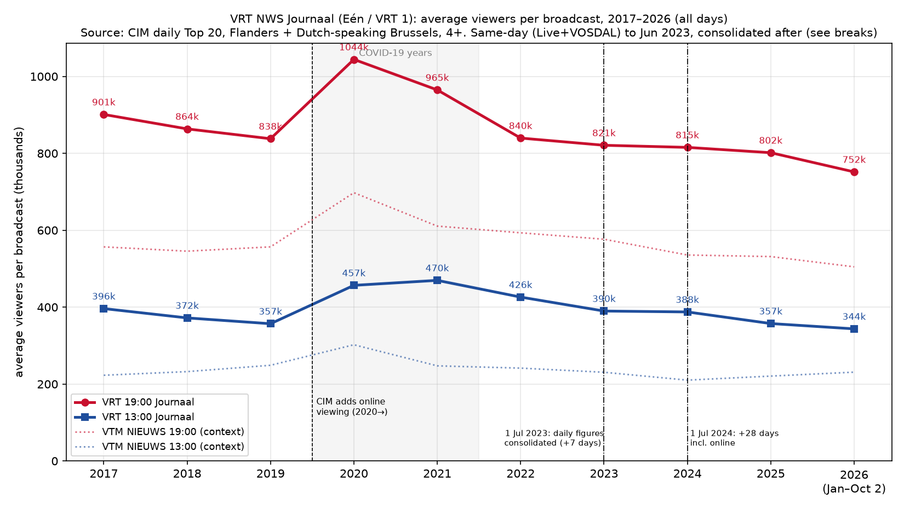
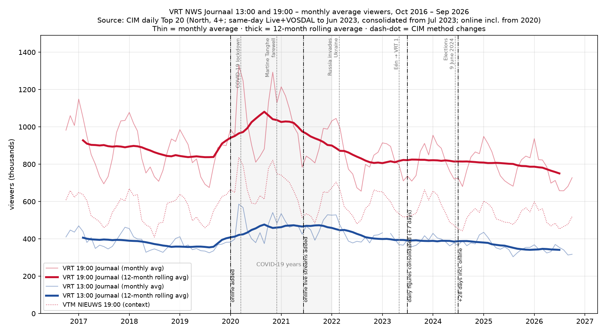
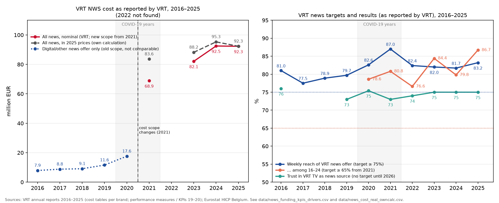

# VRT NWS Journaal — 10-year viewing report (13:00 and 19:00 news), 2016–2026

Ten years of viewing figures for the two main daily TV news broadcasts of the Flemish public broadcaster VRT: **the 13:00 Journaal ("Het 1 uur-journaal")** and **the 19:00 Journaal ("Het 7 uur-journaal")** on Eén, which became **VRT 1** on 1 May 2023.

*Compiled 3 October 2026. Every figure has a source; anything that could not be found is marked "not found". Nothing is estimated.*

*Companion report on VRT's overall TV ratings (market shares versus DPG Media and Play, reach, VRT NU/VRT MAX, top programmes): [vrt-overall-ratings-10yr-report](https://github.com/STP-KAS/vrt-overall-ratings-10yr-report).*

**Contents:** [Why](#why) · [How](#how) · [Sources](#sources) · [Conclusion](#conclusion) · [Other](#other)

---

## Why

The question: **how has viewing of the VRT NWS Journaal at 13:00 and 19:00 changed over the past ten years, and what drove the ups and downs?**

The 19:00 Journaal has long been the most-watched daily programme in Flanders, and the 13:00 Journaal is its midday counterpart. At the same time, news habits are moving online (VRT MAX, the VRT NWS app, social media). This report gathers credible, sourced numbers into one place, as an overview of:
* the year-by-year average audience for each broadcast;
* the peaks (attacks, COVID-19, elections, war) and the long-term direction;
* how the Journaal compares with its commercial rival VTM NIEUWS and with wider news-use surveys;
* where the measurement method changed, so the trend is not misread.

---

## How

**1. Main data: CIM daily Top 20.** CIM (Centrum voor Informatie over de Media) is Belgium's official audience-measurement body. Its public results page ([cim.be/nl/televisie](https://www.cim.be/nl/televisie)) lists the 20 most-watched programmes of each day (programmes longer than 15 minutes). The figures cover region North (Flanders + Dutch-speaking Brussels), viewers aged 4+ including guests. **Up to late June 2023 the daily values are same-day figures** (live or later the same day, "Live+VOSDAL"). **From early July 2023 the published daily values are CIM's consolidated figures** (+7 days of delayed viewing; from 1 Jul 2024 +28 days incl. online). See the methodology breaks below.
* `scripts/cim_fetch.py` requested every day from 1 Sep 2016 to 2 Oct 2026, using the same request the public page makes. The archive starts in October 2016, which leaves **3,645 days with data**.
* `scripts/parse_cim.py` extracts the news rows. A few malformed 2016–2017 rows and some autumn-2024 values with decimals (e.g. "971.420,70") are repaired and rounded, not dropped.
* `scripts/analyse.py` picks the regular broadcasts by title and time slot: "HET 7 UUR-JOURNAAL" (or "VRT NWS JOURNAAL" in early 2023) at 18:45–19:30, and "HET 1 UUR-JOURNAAL" at 12:45–13:30. It then computes per year: the average over all days, the Monday–Friday average, the median and the best day. It also computes monthly averages, a 12-month rolling average, and a same-period (1 Jan – 30 Sep) comparison so the incomplete year 2026 can be read fairly.

**2. Coverage check.** CIM only lists the Top 20, so a broadcast that falls below 20th place on a given day would be missing. In practice the 19:00 Journaal is captured on 98–100% of days and the 13:00 Journaal on 98–100% of days in every year except 2023 (88%, a CIM data gap; see [Other](#other)). The averages therefore cover nearly every broadcast. Coverage per year is listed in the table and in `data/annual_from_cim_daily_top20.csv`.

**3. Methodology breaks (important for reading the trend).** CIM changed what it counts during the period:

| From | Change | Effect on this report |
|---|---|---|
| 1 Jan 2016 | CIM currency becomes Live+7+Guests | The daily Top 20 used here was Live+VOSDAL+Guests (same-day viewing) until June 2023, so it is not affected before then. |
| **1 Jan 2020** | CIM starts adding **online viewing** of full TV programmes ("alle schermen") | **2020+ figures include online viewers; 2016–2019 are TV only.** The 2020 rise is therefore partly a method effect, and the real post-2020 decline on TV is somewhat bigger than shown. |
| 1 Jan 2021 | Online fragments counted | Same direction (small upward effect). |
| **11 Jun 2021** | Online **live** streams counted | Same direction. Live streams of the Journaal on VRT MAX/VRT NWS app now count. |
| 1 Mar 2021 | New definition of "Total TV" (affects market shares) | Market-share comparisons before and after 2021 carry a small break. |
| **1 Jul 2023** | **The daily Top-20 values switch from same-day (Live+VOSDAL) to CIM's consolidated figures (Live+7)** (own finding: the switch falls between 26 Jun and 9 Jul 2023) | 2023 is a mixed year (Jan–Jun same-day, Jul–Dec Live+7). For the Journaal the effect is small: on 13 matched news broadcasts 2018–2023, the same-day figure was 98.9–100.4% of the Live+7 figure (mean 99.6%). Use the like-for-like table for trends. |
| **1 Jul 2024** | Weekly/yearly figures extended to 28 days after broadcast, incl. online (Live+28) | **The daily values follow** (from Jul 2024 they equal the yearly Top-100 values exactly, e.g. 19:00 Journaal of 1 Jul 2024: 1,178,300 in both). How much the extra 8–28 days add for the Journaal is **unknown**: CIM publishes no same-day figure for these broadcasts any more. |

Source: [CIM TV reglement](https://www.cim.be/sites/default/files/2026-03/reglement_TELEVISIE.pdf) and the notes on [cim.be/nl/televisie](https://www.cim.be/nl/televisie) (CIM's key-figures page states that each programme is reported three times: Live+VOSDAL, Live+7 and Live+28). The July 2023 switch is an own finding from comparing the same broadcasts in CIM's daily Top 20 and yearly Top 100 ([`data/consolidation_check_news_daily_vs_yearly.csv`](data/consolidation_check_news_daily_vs_yearly.csv); the same comparison over all programmes is in the companion report). The online changes and the 2023/2024 consolidation steps are drawn on both charts.

**6. Like-for-like comparisons.** Because of the 2023 and 2024 breaks, trends are also compared over the same calendar days in two periods that share the same value basis (`data/like_for_like_comparisons.csv`). Days missing in either period are dropped, so the 13:00 data gap of early 2023 does not bias the result.

**4. Published figures.** Single-day records, channel market shares, VRT's daily reach of all its journaal broadcasts, and VRT NWS online visitors are copied **verbatim** from VRT annual reports, VRM supervision reports, VRT NWS / VRT press releases and CIM's yearly tables. Each one carries its URL in `data/vrt_journaal_10yr_data.csv`.

**5. Context figures.**
* **VTM NIEUWS** 13:00 and 19:00 were extracted from the same CIM daily Top 20 with the same rules. That makes them directly comparable, and they serve only as a benchmark: is the decline VRT-specific or TV-news-wide?
* **Survey data** from the Digital News Report Flanders (imec-SMIT-VUB) and from Statistiek Vlaanderen is quoted as published. These describe news *habits* (the share of people who watch TV news), not viewing figures, and are not mixed into the CIM numbers.

---

## Sources

**Primary sources** (the organisation that measured or published the figure):

| Source | Used for |
|---|---|
| CIM – TV results (daily Top 20, yearly Top 100, market shares): https://www.cim.be/nl/televisie | All per-broadcast averages, best days, VTM context, channel market share 2018–2025, yearly Top 100 peaks |
| CIM – TV reglement: https://www.cim.be/sites/default/files/2026-03/reglement_TELEVISIE.pdf | Methodology breaks (2016, 2020, 2021, 2024) |
| CIM – Methodology TV 2024: https://cim.be/sites/default/files/2026-03/methodologie_television_Methodologie_NL2024.pdf | Measurement background |
| VRT annual report 2016: https://www.vrt.be/nl/assets/files/2024-09/VRTJaarverslag2016.pdf | Daily/weekly reach of journaals 2016, deredactie.be visitors |
| VRT annual report 2017: https://www.vrt.be/nl/assets/files/2024-09/LRN-VRT-Jaarverslag-2017-web-low-2.pdf | Eén market share 2016–2017 (CIM/GfK) |
| VRT annual report 2018: https://www.vrt.be/nl/assets/files/2024-09/VRTJaarverslag2018WEB.pdf | Journaal reach 2017–2018, VRT NWS update (14 Jun 2018), site/app visitors |
| VRT annual report 2019: https://www.vrt.be/nl/assets/files/2024-09/VRT_Jaarverslag-2019-CORPS-lowlowres.pdf | Journaal reach 2019, site visitors, news performance measures 2016–2019 |
| VRT annual report 2020: https://www.vrt.be/nl/assets/files/2024-09/VRT_jaarverslag2020_A4_030_pages_Compressed.pdf | Journaal reach 2020, 27 Mar 2020 record (1,748,370), site visitors |
| VRT annual reports 2021, 2024, 2025: https://www.vrt.be/nl/assets/files/2024-09/Jaarverslag2021.pdf · https://www.vrt.be/nl/assets/files/2025-06/Jaarverslag-2024.pdf · https://www.vrt.be/nl/assets/files/2026-07/JVS_2025_0.pdf | No journaal reach published (→ "not found"); VRT NWS costs and news KPIs 19–21, 23, 31 |
| VRT press release, annual report 2025: https://communicatie.vrt.be/vrt-bereikt-recordaantal-vlamingen-en-versnelt-digitale-groei-in-2025 | Context (no journaal figure) |
| VRT – 2024 VRT MAX year review: https://communicatie.vrt.be/2024-het-jaar-van-een-nieuwe-groeispurt-voor-vrt-max | VRT NWS Journaal = #2 video title on VRT MAX in 2024 |
| VRT NWS – Martine Tanghe's last Journaal: https://www.vrt.be/vrtnws/nl/2020/11/30/martine-tanghe-op-bezoek-bij-koning-filip-ik-ben-blij-en-trots/ | 2,001,867 viewers, best-watched Journaal ever |
| VRT NWS – Eén becomes VRT 1: https://www.vrt.be/vrtnws/nl/2023/04/28/een-wordt-vanaf-vandaag-vrt-1/ | Rename date 1 May 2023 |
| VRM – supervision report VRT 2017: https://www.vlaamseregulatormedia.be/sites/default/files/2025-01/vrt2017.pdf | Journaal reach 2017, vrtnws.be visitors 2017 |
| VRM – supervision report VRT 2020 (SD 2.1): https://www.vlaamseregulatormedia.be/nl/over-vrm/rapporten/2020/toezichtsrapport-vrt/toezichtsrapport-vrt-2020/strategische-doelstelling-2-0 | Confirms 2019/2020 journaal reach |
| imec-SMIT-VUB – Digital News Report Flanders policy brief: https://smit.research.vub.be/en/policy-brief-93-digital-news-report-2025-wider-access-weaker-pull-more-channels-less-interest-and-a | Survey: TV evening news use 73% (2017) → 51% (2026) |
| imec.digimeter 2025: https://www.imec.be/sites/default/files/2026-03/imec.digimeter-2025-rapport.pdf | Reasons for the decline: live TV, news via social media and search (pp. 23, 39) |
| VRT management contract 2026–2030: https://www.vrt.be/nl/assets/files/2025-10/BHO_VRT_2025_digitaal-14-10-2025.pdf | News targets 2026–2030 (KPIs 11, 13, 14, 16, 18) |
| Eurostat HICP Belgium (prc_hicp_aind): https://ec.europa.eu/eurostat/api/dissemination/statistics/1.0/data/prc_hicp_aind?geo=BE&coicop=CP00&unit=INX_A_AVG&format=JSON | Inflation adjustment of news costs (own calculation) |
| Statistiek Vlaanderen – Nieuwsgebruik: https://www.vlaanderen.be/statistiek-vlaanderen/media-en-mediagebruik/nieuwsgebruik | Survey: weekly TV news use 70% (2025), −8 pp vs 2021 |

**Secondary sources** (media or reference works reporting other people's data):

| Source | Used for |
|---|---|
| Showbizzsite – viewing figures 22 March 2016 (reproduces the CIM day top 10): https://www.showbizzsite.be/nieuws/kijkcijfers-dinsdag-22-maart-2016-1499876 | Brussels attacks day (before the CIM online archive starts) |
| TVvisie – KIES24 viewing figures: https://tvvisie.be/nieuws/belgie/kijkcijfers-meer-dan-2-miljoen-kijkers-voor-kies24-op-vrt-1_131238/ | Election night 9 June 2024 |
| VRT annual report 2023, copy hosted by Mediaspecs: https://www.mediaspecs.be/wp-content/uploads/2024/06/vrt-jaarverslag-2023.pdf | VRT NWS cost 2023, news KPIs 2023 (no copy found on vrt.be) |
| Wikipedia – VRT NWS journaal: https://nl.wikipedia.org/wiki/VRT_NWS_journaal | Format/studio timeline only (2016 studio, 2021 studio, 2022 rename); no viewing figures taken from it |

---

## Conclusion

**In one sentence:** the 19:00 Journaal is still Flanders' biggest daily programme, but it and the 13:00 Journaal have lost about a tenth of their audience since 2017. COVID-19 interrupted that decline in 2020–2021, and since 2022 the slide has continued at a slow, steady pace.

* **19:00 Journaal:** about **901,000 viewers per broadcast in 2017**, **802,000 in 2025** (−11%), and **752,000** for January–September 2026, which is 4.9% below the same months of 2025.
* **13:00 Journaal:** **396,000 (2017) → 357,000 (2025)** (−10%), and **344,000** so far in 2026 (−4.4% compared with January–September 2025). It stays at about 40–45% of the 19:00 audience.
* **COVID-19 peak:** in 2020 the averages reached **1.04 million** (19:00, +25% on 2019) and **457,000** (13:00, +28%). The two best-watched Journaals ever both fall in 2020: **1,748,370 on 27 March** ([VRT annual report 2020](https://www.vrt.be/nl/assets/files/2024-09/VRT_jaarverslag2020_A4_030_pages_Compressed.pdf)) and **2,001,867 on 30 November**, Martine Tanghe's last Journaal ([VRT NWS](https://www.vrt.be/vrtnws/nl/2020/11/30/martine-tanghe-op-bezoek-bij-koning-filip-ik-ben-blij-en-trots/)).
* **The decline on the TV set is bigger than shown.** Since 2020, online viewing is included in the figures, and since July 2023 the daily figures are consolidated (+7 days, +28 days incl. online from July 2024). Both changes push the later years up, so the headline decline is, if anything, slightly understated. For the Journaal the +7-day consolidation is small (same-day = 99.6% of Live+7 on average in 13 matched news broadcasts); the effect of the 28-day window is unknown.
* **Like-for-like the trend holds.** On the same basis: 19:00 **−6.9%** from 2017 to 2022 and **−7.5%** from Jan–Jun 2022 to Jan–Jun 2023 (both same-day), then **−1.7%** from Jul–Dec 2024 to Jul–Dec 2025 and **−4.9%** from Jan–Sep 2025 to Jan–Sep 2026 (both Live+28). The apparent flattening of the 19:00 Journaal in 2023–2024 (821k → 815k) partly reflects the change of basis. The 13:00 Journaal was still *above* its 2017 level in 2022 (+7.5%, same-day) and lost most of its audience since: −8.7% (Jan–Jun 2022 → 2023), −11.7% (Jul–Dec 2024 → 2025) and −4.5% (Jan–Sep 2025 → 2026).
* **This is a TV-news-wide trend.** VTM NIEUWS 19u fell from 557k to 532k (2017–2025). VRT keeps about **60% of the combined VRT + VTM 19:00 news audience** (61.8% in 2017).
* **Habits confirm it:** the share of Flemish news users who watch TV evening news fell from 73% (2017) to 51% (2026) (imec-SMIT-VUB). Meanwhile the Journaal does well online: it was the #2 video title on VRT MAX in 2024 (VRT).

**Like-for-like comparisons** (same calendar days in both periods; own calculation from the CIM daily Top 20):

| Comparison | VRT 19:00 Journaal | VRT 13:00 Journaal | VTM NIEUWS 19:00 (context) | Same value basis? |
|---|---|---|---|---|
| Jan-Dec 2017 vs Jan-Dec 2022 | 902.212 → 839.998 (**-6.9%**) | 396.534 → 426.303 (**+7.5%**) | 556.732 → 593.085 (**+6.5%**) | yes: both same-day |
| Jan-Jun 2017 vs Jan-Jun 2023 | 922.315 → 840.314 (**-8.9%**) | 391.604 → 396.261 (**+1.2%**) | 568.691 → 579.655 (**+1.9%**) | yes: both same-day |
| Jan-Jun 2022 vs Jan-Jun 2023 | 909.501 → 840.875 (**-7.5%**) | 434.178 → 396.250 (**-8.7%**) | 613.219 → 579.513 (**-5.5%**) | yes: both same-day |
| Jul-Dec 2022 vs Jul-Dec 2023 | 770.226 → 802.789 (**+4.2%**) | 399.026 → 385.591 (**-3.4%**) | 573.809 → 573.744 (**-0.0%**) | NO: same-day vs consolidated Live+7 (straddles 1 Jul 2023) |
| Jul-Dec 2023 vs Jul-Dec 2024 | 801.924 → 788.803 (**-1.6%**) | 385.463 → 382.302 (**-0.8%**) | 573.630 → 508.584 (**-11.3%**) | NO: Live+7 vs Live+28 incl. online (straddles 1 Jul 2024) |
| Jul-Dec 2024 vs Jul-Dec 2025 | 788.803 → 775.086 (**-1.7%**) | 382.101 → 337.222 (**-11.7%**) | 508.584 → 520.797 (**+2.4%**) | yes: both Live+28 incl. online |
| Jan-Sep 2025 vs Jan-Sep 2026 | 790.308 → 751.786 (**-4.9%**) | 359.825 → 343.655 (**-4.5%**) | 524.298 → 504.788 (**-3.7%**) | yes: both Live+28 incl. online |
| Jan-Dec 2017 vs Jan-Dec 2025 (headline) | 901.084 → 800.932 (**-11.1%**) | 396.361 → 357.500 (**-9.8%**) | 556.732 → 531.665 (**-4.5%**) | NO: same-day vs Live+28 incl. online |

*Rows marked "NO" straddle a break and are shown only to make its size visible. Means are over days present in both periods, so they can differ slightly from the yearly averages below. Source: [`data/like_for_like_comparisons.csv`](data/like_for_like_comparisons.csv).*

### Results: year by year

The per-broadcast columns are computed from the CIM daily Top 20 (North, 4+ incl. guests; same-day Live+VOSDAL to June 2023, online included from 2020; consolidated Live+7 from July 2023 and Live+28 incl. online from July 2024, so **2023 and 2024 are mixed years**). "Avg" is the mean over all days of that year on which the broadcast was captured.

| Year | **19:00** avg/broadcast | 19:00 avg Mon–Fri | 19:00 best day | **13:00** avg/broadcast | 13:00 avg Mon–Fri | 13:00 best day | 13:00 days captured | Eén/VRT 1 channel market share (%) ¹ | Daily reach of all VRT TV journaals ² |
|---|---|---|---|---|---|---|---|---|---|
| 2016 (Oct–Dec only) | **1.016.411** | 1.075.348 | 1.355.048 (2016-11-09) | **431.135** | 416.336 | 700.772 (2016-11-20) | 98.9% | 32.6 | 1.919.559 |
| 2017 | **901.084** | 942.820 | 1.358.540 (2017-12-11) | **396.260** | 382.501 | 691.367 (2017-12-10) | 99.4% | 30.1 | 1.841.411 |
| 2018 | **863.559** | 900.029 | 1.337.923 (2018-06-18) | **372.023** | 357.525 | 687.536 (2018-04-01) | 99.2% | 30.4 | 1.784.923 |
| 2019 | **837.979** | 879.428 | 1.134.694 (2019-01-21) | **356.918** | 340.588 | 616.052 (2019-03-03) | 99.7% | 29.6 | 1.749.894 |
| 2020 | **1.044.233** | 1.066.100 | 2.008.425 (2020-11-30) | **456.711** | 434.061 | 1.041.306 (2020-03-22) | 99.5% | 30.9 | 1.987.954 |
| 2021 | **964.919** | 997.675 | 1.360.441 (2021-01-20) | **469.656** | 453.338 | 1.254.726 (2021-08-01) | 99.5% | 32.5 | not found |
| 2022 | **839.671** | 873.527 | 1.215.236 (2022-02-24) | **426.147** | 418.868 | 710.427 (2022-02-18) | 98.6% | 32.0 | not found |
| 2023 | **820.963** | 863.075 | 1.192.097 (2023-03-20) | **389.901** | 378.621 | 631.194 (2023-07-23) | 88.2% | 31.7 | not found |
| 2024 | **815.469** | 846.069 | 1.122.644 (2024-01-17) | **387.532** | 377.027 | 616.749 (2024-01-14) | 99.7% | 32.2 | not found |
| 2025 | **801.628** | 835.823 | 1.084.008 (2025-01-27) | **357.369** | 352.382 | 610.373 (2025-01-12) | 99.5% | 30.3 | not found |
| 2026 (1 Jan–1 Oct) | **751.697** | 783.867 | 1.090.074 (2026-01-05) | **343.558** | 339.957 | 532.263 (2026-03-01) | 99.6% | n/a (year not complete) | not found |

¹ 2016–2017: [VRT annual report 2017](https://www.vrt.be/nl/assets/files/2024-09/LRN-VRT-Jaarverslag-2017-web-low-2.pdf) (source CIM/GfK); 2018–2025: [CIM yearly market shares](https://www.cim.be/nl/televisie) (4+, 02–26h). This is the share for the whole channel, not for the Journaal itself. CIM has no 2017 market-share table online.
² Average number of Flemings (4+) reached per day by all VRT TV journaal broadcasts together (13:00, 18:00/update, 19:00, late news, extras). Sources: VRT annual reports [2016](https://www.vrt.be/nl/assets/files/2024-09/VRTJaarverslag2016.pdf), [2018](https://www.vrt.be/nl/assets/files/2024-09/VRTJaarverslag2018WEB.pdf) (gives 2017 and 2018), [2019](https://www.vrt.be/nl/assets/files/2024-09/VRT_Jaarverslag-2019-CORPS-lowlowres.pdf), [2020](https://www.vrt.be/nl/assets/files/2024-09/VRT_jaarverslag2020_A4_030_pages_Compressed.pdf). The annual reports for 2021–2025 no longer publish this figure, so those years are "not found". Weekly reach: 63.7% (2016), 61.1% (2017), 59.7% (2018), 58.3% (2019), 60.3% (2020).

**Same-period comparison (1 January – 30 September), useful for reading 2026:**

| | 2017 | 2019 | 2021 | 2023 | 2025 | 2026 |
|---|---|---|---|---|---|---|
| 19:00 Journaal | 864.833 | 817.854 | 968.430 | 784.906 | 790.859 | **751.786** |
| 13:00 Journaal | 385.613 | 351.079 | 463.015 | 386.715 ³ | 359.654 | **343.655** |

³ 2023 is missing ~40 days for the 13:00 (see gaps). Value basis: 2017–2021 same-day; 2023 Jan–Jun same-day and Jul–Sep Live+7; 2025 and 2026 both Live+28 incl. online, so **2025 vs 2026 is like-for-like**, while 2023 vs 2025 is not.

**Best-watched 19:00 Journaal per year in CIM's yearly Top 100** (a different metric: Live+7, Live+28 incl. online from July 2024, in thousands): 2018 – 1,337.9 (18 Jun) · 2019 – 1,134.7 (21 Jan) · 2020 – **2,030.6 (30 Nov)** · 2021 – 1,367.7 (20 Jan) · 2022 – 1,229.3 (24 Feb, Russia invades Ukraine) · 2023 – 1,199.3 (20 Mar) · 2024 – 1,178.3 (1 Jul) · 2025 – 1,084.0 (27 Jan). Each year's peak is lower than the year before, except in 2020–2021. Source: [CIM yearly Top 100](https://www.cim.be/nl/televisie).

### Key events

| Date | Event | Viewing impact (source) |
|---|---|---|
| 15 Feb 2016 | New blue-white Journaal studio look | – ([Wikipedia](https://nl.wikipedia.org/wiki/VRT_NWS_journaal), secondary) |
| 22 Mar 2016 | Brussels terror attacks | 19:00 Journaal **1,383,976**; 13:00 Journaal **682,099** ([Showbizzsite, CIM day top 10](https://www.showbizzsite.be/nieuws/kijkcijfers-dinsdag-22-maart-2016-1499876)). This is before the CIM online archive starts (Oct 2016). |
| 14 Jun 2018 | The 18:00 Journaal is replaced by the short "VRT NWS update" | ([VRT annual report 2018](https://www.vrt.be/nl/assets/files/2024-09/VRTJaarverslag2018WEB.pdf)) |
| Mar–Apr 2020 | COVID-19 lockdown, extra and longer journaals | 27 Mar 2020: **1,748,370** at 19:00 ([VRT annual report 2020](https://www.vrt.be/nl/assets/files/2024-09/VRT_jaarverslag2020_A4_030_pages_Compressed.pdf)); 22 Mar 2020: 13:00 Journaal **1,041,306** (CIM). Monthly 19:00 average >1.3 million in March 2020. |
| 30 Oct 2020 | Second-wave lockdown announcement | 19:00: **1,702,882** (CIM) |
| 30 Nov 2020 | Martine Tanghe's last Journaal | **2,001,867**, best-watched Journaal ever ([VRT NWS](https://www.vrt.be/vrtnws/nl/2020/11/30/martine-tanghe-op-bezoek-bij-koning-filip-ik-ben-blij-en-trots/)); CIM daily figure 2,008,425 |
| 5 Apr 2021 | New/refurbished Journaal studio | – ([Wikipedia](https://nl.wikipedia.org/wiki/VRT_NWS_journaal), secondary) |
| 24 Feb 2022 | Russia invades Ukraine | 19:00: **1,215,236** (CIM), best day of 2022 |
| 29 Aug 2022 | "Het journaal" renamed "VRT NWS journaal" | – ([Wikipedia](https://nl.wikipedia.org/wiki/VRT_NWS_journaal), secondary) |
| 1 May 2023 | Channel Eén renamed **VRT 1** | no visible break in the figures ([VRT NWS](https://www.vrt.be/vrtnws/nl/2023/04/28/een-wordt-vanaf-vandaag-vrt-1/)) |
| 9 Jun 2024 | Federal/regional elections | The evening Journaal was replaced by the KIES24 election marathon: 2,151,277 viewers reached, peak 987,266 at 19:38 ([TVvisie](https://tvvisie.be/nieuws/belgie/kijkcijfers-meer-dan-2-miljoen-kijkers-voor-kies24-op-vrt-1_131238/)). Not counted in the 19:00 averages. |
| 2024 | VRT MAX: "VRT NWS Journaal" is the #2 video title of the year | ([VRT](https://communicatie.vrt.be/2024-het-jaar-van-een-nieuwe-groeispurt-voor-vrt-max)) |

### Reasons for the decline (sourced)

This report does not measure how much each factor contributes. It lists only the factors that the sources name or measure. Figures and links are in [`data/news_funding_kpis_drivers.csv`](data/news_funding_kpis_drivers.csv).

* **Less TV news, more news avoidance.** In the Digital News Report Flanders, the share of news users who watch TV evening news fell from **73% (2017) to 51% (2026)**, and among young people from about 60% to about one in three. Daily news use fell from 89% to 72%. The share who sometimes or often **avoid the news** rose from **48% to 66%**, and the share very or extremely interested in news fell from 62% to 36% (59% in 2021) ([SMIT/VUB policy brief 93](https://smit.research.vub.be/en/policy-brief-93-digital-news-report-2025-wider-access-weaker-pull-more-channels-less-interest-and-a)).
* **News moves to smartphones, social media and search.** In the same survey, social media is the main news source for 16% of all news users and **43% of 18–24-year-olds (23% in 2017)**. Going directly to news sites and apps rose from 32% to 44%. In the [imec.digimeter 2025](https://www.imec.be/sites/default/files/2026-03/imec.digimeter-2025-rapport.pdf) (p. 39), 44% of Flemings follow news via social media daily (18–24: 65%, 25–34: 56%), close to national TV news (51%, −2 points in a year). 33% follow news via search engines daily (+11 points, which Digimeter links to AI overviews).
* **Weekly TV news use** fell to 70% in 2025, 8 points lower than in 2021 ([Statistiek Vlaanderen](https://www.vlaanderen.be/statistiek-vlaanderen/media-en-mediagebruik/nieuwsgebruik)).
* **Younger viewers watch little live TV.** Daily live TV viewing is 40% of Flemings in 2025 (56% in 2020). It is 14% among 25–34-year-olds and 17% among 18–24-year-olds, against 65% among 65–74-year-olds (Digimeter p. 23). A fixed-time broadcast like the Journaal depends on live viewing.
* **Part of the audience moved to VRT NWS online.** VRT NWS online had **270,140 daily unique visitors in 2016 and 960,009 in 2020** (VRT annual reports; see the master table). In the Digital News Report, weekly use of VRT NWS online is 40% (from 33%). The Journaal was the #2 video title on VRT MAX in 2024. Since 2020 CIM includes online viewing of the broadcast in the figures here, but news read on the site or app is not TV viewing.
* **Trust in VRT news stayed stable.** 73–76% have (much) trust in VRT TV as a news source in every year with data: 76% (2016), 73% (2019), 75% (2025). General trust in news fell from 57% (2017) to just under half (DNR). The sources therefore do not point to falling trust in VRT as a cause.
* **Competition from VTM NIEUWS** follows the same trend (557k → 532k at 19:00, 2017–2025; see above). VRT's share of the combined 19:00 news audience stayed at about 60%, so the decline is not a shift from VRT to VTM.
* **Measurement changes** (online viewing added in 2020, consolidated daily figures from July 2023) push the later years up. They do not cause the decline, but they make it look slightly smaller (see *How*).

### Public funding vs results

VRT's public funding as a whole (pillar 1: 277.1 M EUR in 2015, 319.4 M EUR in 2025; −15% in real terms) and all management-contract targets are analysed in the companion report: [**Public funding vs results** (VRT overall report)](https://github.com/STP-KAS/vrt-overall-ratings-10yr-report#public-funding-vs-results). The news-specific figures are below. Data: [`data/news_funding_kpis_drivers.csv`](data/news_funding_kpis_drivers.csv) and [`data/news_cost_real_owncalc.csv`](data/news_cost_real_owncalc.csv).

* **What news costs.** From 2021 VRT books all costs of its Information department under "VRT NWS", including the TV and radio news programmes: **68.9 M EUR (2021), 82.1 M EUR (2023), 92.5 M EUR (2024) and 92.3 M EUR (2025)** (VRT annual reports, cost tables "andere aanbodsmerken"). That is +34% nominal from 2021 to 2025, or **+10% in 2025 prices** (83.6 → 92.3 M EUR; own calculation with the Eurostat HICP for Belgium). Per inhabitant of Flanders it is 10.36 EUR (2021) and 13.45 EUR (2025) (own calculation). 2022: **not found** (the 2022 jaarbeeld has no cost tables). Before 2021 VRT reported only the cost of the digital/other VRT NWS offer (7.9 M EUR in 2016 to 17.6 M EUR in 2020), with the TV and radio news included in the channel costs. These figures **cannot be compared** with 2021 onwards. A separate cost for the Journaal itself: **not found**.
* **News targets in the management contracts and whether they were met (as reported by VRT):**

| Target | 2016–2020 | 2021–2025 | Result |
|---|---|---|---|
| Weekly reach of VRT's total news offer ≥ 75% | 81.0% (2016), 77.5% (2017), 78.9%, 79.7%, 82.6% (2020) | KPI 19: 87.0% (2021), 82.4%, 82.0%, 81.7%, 83.2% (2025) | **met every year** |
| Weekly news reach among 16–24 ≥ 65% (from 2021) | 78.6% (2020, no target) | 80.8%, 76.6%, 84.4%, 79.8%, 86.7% | **met every year** |
| Trust in VRT news (no numeric target until 2026) | TV 76% (2016), 73% (2019), 75.4% (2020) | KPI 20: TV 73–75%; vrtnws.be 66% (2021) → 71% (2025) | stable; 2017–2018 not found on a comparable question |
| Investigative journalism | ≥ 10 Pano reports: 17 in 2019 (met) | KPI 23: ≥ 15 stories a year | 2021–2025 counts not copied here (see the annual reports) |
| Culture items in Het Journaal ≥ 365 a year | 610 (2019) | KPI 31: 647 (2024), 662 (2025) | met |
| Impartiality | – | KPI 21: monitored (VRM study 2024); numeric result not found | – |
| Journaal viewers or market share | not found | not found | **no such target** |

* **Reading the two together.** The news targets measure weekly reach over all platforms and trust. They do not measure TV audiences. VRT met every reach target while the 19:00 Journaal lost about a tenth of its viewers (2017–2025) and the daily reach of all VRT TV journaals fell from 1,919,559 (2016) to 1,749,894 (2019) (VRT annual reports; 2021–2025 not found). Over 2021–2025 the cost of VRT news rose by 10% in real terms, while news reach stayed at 82–87% and the TV audience of the Journaal kept falling slowly.
* **2026–2030 contract** ([PDF](https://www.vrt.be/nl/assets/files/2025-10/BHO_VRT_2025_digitaal-14-10-2025.pdf)): trust in VRT NWS ≥ 70% (KPI 11, the first numeric trust target), VRT NWS weekly reach ≥ 75% and ≥ 65% of each relevant group (KPI 14), 15 investigative stories rising to 20 (KPI 13), analysis offer reaching ≥ 45% rising to 50% (KPI 16), and ≥ 365 culture items in the Journaal (KPI 18). First results are due by 1 June 2027.

---

## Other

**Data gaps**
* **25 Jan – 5 Mar 2023:** CIM's daily Top 20 lists only afternoon and evening programmes in this period (CIM does not explain why on its results page), so the **13:00 Journaal is missing for ~40 days** and 2023 coverage is 88%. The 19:00 Journaal is present (titled "VRT NWS JOURNAAL" at the time).
* Days with no CIM data at all: 1–30 Sep 2016, 31 Oct 2016, 4 May 2017, 23 Dec 2017, 14–15 Aug 2019, 20–22 Mar 2026 (and 2 Oct 2026, not yet published).
* **Official yearly averages** for the 13:00/19:00 Journaal are not published by VRT or CIM in any source found. The yearly averages here are computed from CIM's public daily data.
* **Market share of the Journaal itself** per year: not found (only the channel's market share is given).
* **Daily reach of all VRT journaals, 2021–2025:** not found (VRT annual reports stopped publishing it).
* **Online/VRT MAX viewers of the Journaal as a separate series:** not found (CIM folds online viewing into the totals).
* **News costs:** VRT NWS cost for 2022, a separate cost of the Journaal, and a comparable news cost before 2021: not found. Comparable trust figures for 2017–2018 and a numeric impartiality result: not found. The Statbel CPI website could not be accessed, so the Eurostat HICP for Belgium is used for real terms.
* **2016 before October:** not in the CIM online archive. Only single days are available via press reports (e.g. 22 Mar 2016).

**Corrections**
* **Daily value basis (corrected 3 Oct 2026).** Earlier versions of this report described all daily figures as same-day (Live+VOSDAL) and said the July 2024 change did not affect them. In fact the daily values are consolidated from July 2023 (Live+7) and July 2024 (Live+28 incl. online). No figure changed. Only the descriptions, the break markers, and the new like-for-like and consolidation-check tables were added.
* The channel **Eén was renamed VRT 1 on 1 May 2023** ([VRT NWS](https://www.vrt.be/vrtnws/nl/2023/04/28/een-wordt-vanaf-vandaag-vrt-1/)), not in 2025 as first assumed in the brief. In CIM's data the channel name switches from "EEN" to "VRT 1" on 2 May 2023. There is no break in the figures.
* The two sources for the Tanghe farewell differ slightly: VRT NWS reports 2,001,867, while the CIM daily Top 20 shows 2,008,425 and the CIM yearly Top 100 shows 2,030.6k (a different metric, Live+7). This report quotes VRT's figure for the record and shows CIM's figures where CIM data is used.

**Limitations**
* Until June 2023 the daily-Top-20 metric (Live+VOSDAL) is slightly **lower** than the Live+7 figures VRT sometimes quotes in press releases; from July 2023 it is the consolidated figure. Compare only like with like.
* Broadcasts that start outside the time slot are not counted, e.g. the 19:00 Journaal of 1 Jul 2024 started at 20:14 after a Euro 2024 match.
* 2016 covers October–December only, the strongest TV season. Do not compare it with full years. 2026 covers 1 January – 1 October. Use the same-period table for a fair comparison.
* Strong seasonality: for the 19:00 Journaal, July–August is typically 20–30% below the winter months (Nov–Feb), e.g. 689k vs 884k in 2025. Use the 12-month rolling average to read the trend.
* Days when the broadcast was moved or replaced (election nights such as 9 June 2024, big live sport) are missing or show up as outliers. For example, the 13:00 Journaal of Sunday 1 Aug 2021 (1,254,726 viewers) started late at 13:23. The cause was not verified; it was probably a lead-in from preceding live coverage.
* VTM figures are context only. They use the same CIM method, but no editorial comparison is made.

**Repository guide**

| Path | What |
|---|---|
| `data/vrt_journaal_10yr_data.csv` | **Master table**: one figure per row, with metric, unit, source name, **source URL** and notes (CIM-derived averages + published figures from VRT, VRM, CIM). |
| `data/annual_from_cim_daily_top20.csv` | Yearly stats per broadcast (VRT 13:00/19:00, VTM 13:00/19:00): days covered, coverage %, mean, Mon–Fri mean, median, best day. |
| `data/jan_sep_comparison.csv` | 1 Jan–30 Sep averages for every year (fair comparison with 2026). |
| `data/monthly_from_cim_daily_top20.csv` | Monthly averages. |
| `data/daily_journaal_viewers.csv` | Every captured broadcast, day by day (viewers, Top-20 rank, start time, duration) with source URL and metric. |
| `data/cim_days_available.csv` | Days for which CIM returned a Top 20 (the denominator for coverage). |
| `data/like_for_like_comparisons.csv` | Same-calendar-day comparisons per broadcast, with whether both periods share the same value basis. |
| `data/consolidation_check_news_daily_vs_yearly.csv` | News broadcasts found in both the CIM daily Top 20 and the yearly Top 100, with the ratio daily/yearly (size of the same-day vs Live+7 gap). |
| `data/news_funding_kpis_drivers.csv` | VRT NWS costs (two scopes), news targets and results 2016–2025, 2026–2030 news targets, and the sourced indicators behind 'Reasons for the decline'. |
| `data/news_cost_real_owncalc.csv` | VRT NWS cost in 2025 prices and per inhabitant, 2021–2025 (own calculation). |
| `charts/*.png` | The three charts above (all show the COVID-19 years 2020–2021 as a grey band). |
| `scripts/` | `cim_fetch.py` (download), `parse_cim.py` (extract), `analyse.py` (aggregate + charts + master CSV), `consolidation_check.py` (daily vs yearly Top 100 check; needs the local cache), `news_funding_src.py` (news costs, targets and drivers as code + the funding chart). |

To reproduce (Python with `requests`, `pandas`, `matplotlib`): `python scripts/cim_fetch.py 2016-09-01 2026-10-02 4 && python scripts/parse_cim.py && python scripts/analyse.py && python scripts/consolidation_check.py && python scripts/news_funding_src.py`. The fetch script caches CIM's responses in a local `raw/` folder, which is not part of this repository.

**Data and reuse note**
* The bulk raw downloads (one CIM HTML response per day, ~3,700 files) and the downloaded PDF reports are **not** published here. The reason is that CIM's public results carry no explicit open licence, and CIM's rules require correct source attribution. This repository contains only **derived tables** (the Journaal and VTM news rows plus yearly/monthly aggregates). Every row cites its source URL and metric.
* The intermediate file with all news rows from the CIM Top 20 (`data/cim_daily_top20_news.csv`) is regenerated locally by `parse_cim.py` and is no longer tracked. It still exists in the first commit of the repository history.
* Viewing data © CIM; report figures © VRT, VRM, imec-SMIT-VUB, Statistiek Vlaanderen and the cited media. Reuse should cite the original source as given here ("CIM TV – Noorden, 4+, Live+VOSDAL+Guests(+Online)" for CIM daily figures to June 2023, consolidated Live+7 / Live+28 after). The analysis code and the text of this README may be reused freely with attribution to this repository.
